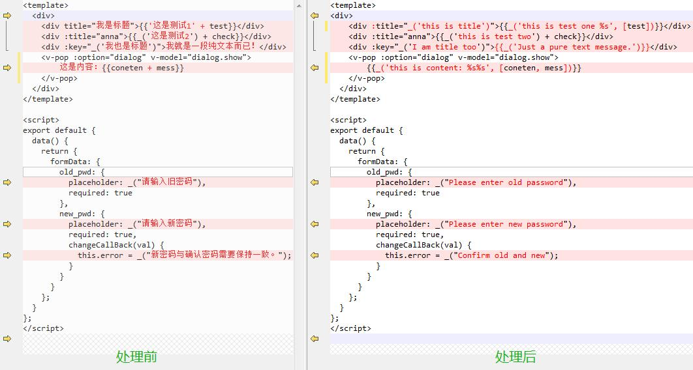

# 翻译工具，Excel/Json处理工具


**该工具同时包含以下几个功能：**

- [提取代码中的中英文词条](#词条提取)
- [通过Excel将代码中的词条替换成目标语言的词条](#翻译文件)
- [检查代码中词条翻译替换的正确性](#翻译检查)
- [将Excel文件转成JSON文件](#Excel转JSON数组或者对象)
- [将JSON文件转成Excel文件](#JSON转EXCEL文件)
- [深度合并JSON文件](#合并JSON文件)
- [原厂代码添加翻译函数](#原厂代码添加翻译函数)
- [提取全部词条](#提取全部词条)
- [语言包检查](#语言包检查)

## 安装

```
npm install b28-cli -g
```

### 指令

```
# 运行工具
cd xxx
b28-cli

# 初始化配置文件b28.config.js
b28-cli init

# 查看版本号
b28-cli -v

# 查看帮助
b28-cli -h
```


## 文件词条提取说明

### JS提取替换方法：

通过[`babylon`](https://www.npmjs.com/package/babylon)将`js`代码转成`AST`(抽象语法树)，通过遍历`AST`得到需要提取的内容，并对`AST`进行修改，最后通过[`babel-generator`](https://www.npmjs.com/package/babel-generator)将`AST`转成代码文件输出。
一开始选择[`Esprima`](https://www.npmjs.com/package/esprima)进行代码转`AST`，但[`Esprima`](https://www.npmjs.com/package/esprima)对注释的处理有点问题，通过[`Escodegen`](https://www.npmjs.com/package/escodegen)将`AST`转代码时，注释丢失或者位置不对，没找到解决方案，故换成[`babylon`](https://www.npmjs.com/package/babylon).

### HTML提取替换方法：

通过[`jsdom`](jsdom)将`html`代码转成`DOM`树，然后对`DOM`进行遍历。

### Vue文件提取替换方法：

将`template`和`script`模块分开进行处理。`script`代码还是按照JS的逻辑进行处理。`template`的解析处理参考`vue`的`compiler`模块进行解析。首先遍历html节点提取翻译相关的属性和文本信息，包括词条的`start`和`end`位置索引，然后解析提取的信息，提取需要翻译的词条，同时将翻译后的词条对原`template`进行原地替换，最后输出替换后的vue文件。		

**对于含有翻译函数`_()`的表达式会直接提取，不包含翻译函数的表达式只有包含中文的情况下才会进行提取和翻译替换。纯英文词条默认不提取，以为无法区分是表达式还是词条。**

默认的处理如下：

- 对于指令只对`v-bind`的指令做处理，其它指令不会涉及多语言相关内容。如果指令中包含`_('')`翻译函数，则只处理翻译函数内的词条，其它内容不做处理。如果不包含翻译函数，且含有中文，则进行提取和替换
- 对于非`v-bind`属性`title`、`alt`、`placeholder`如果内容是中文，则会进行提取，翻译的时候会将该内容替换为对应`v-bind`格式
- 对于文本内容会将`{{}}`模板语法内的表达式提取为参数，然后将整个词条重新组装为`{{_('xxxx %s xxx', [ars])}}`格式，并且将原文本进行替换

示例如下：

```vue
<template>
	<div>
        <div title="我是标题">{{'这是测试1' + test}}</div>
        <div :title="anna">{{_('这是测试2') + check}}</div>
        <div :key="_('我也是标题')">我就是一段纯文本而已！</div>
        <v-pop :option="dialog" v-model="dialog.show">这是内容：{{coneten + mess}}</v-pop>
    </div>
</template>
```

进行工具翻译替换后：

```vue
<template>
	<div>
        <div :title="_('this is title')">{{_('this is test one %s', [test])}}</div>
        <div :title="anna">{{_('this is test two') + check}}</div>
        <div :key="_('This is title too')">{{_('Just a pure text message.')}}</div>
        <v-pop :option="dialog" v-model="dialog.show">{{_('this is content: %s%s', [content, mess])}}</v-pop>
    </div>
</template>
```




## 使用方式

1. 通过[WinForm](B28.exe)界面程序直接操作（只支持windows环境）

   

   

2. 通过[b28.config.js](#b28.config.js)进行配置，在目标路径下面添加`b28.config.js`配置文件，见[参数配置说明](#配置参数说明)
> 如果有读取到配置参数，则直接按配置参数运行工具。若读取的配置错误则会通过下面的使用方式重新输入配置项修正数据。
直接通过命令行交互的形式,如下图
```
    # 切换到目标路径
    cd xxx

    # 运行指令
    b28-cli
```


参数配置见见[参数配置说明](#配置参数说明)


## 配置参数说明
示例`b28.config.js`

```js
// 翻译文件配置
module.exports = {
    commandType: 1,
    /**
     * 待翻译文件根目录
     */
    baseTranslatePath: './test/TestFile/test/allTest',
    /**
     * 翻译后文件输出根目录
     */
    baseTransOutPath: './test/TestFile/output/allTest',
    /**
     * 语言包文件地址
     */
    languagePath: './test/TestFile/testData/allTest/translate.xlsx',
    /**
     * 宏文件地址
     */
    hongPath: './test/TestFile/config/index.js',
    /**
     * key对应列
     */
    keyName: 'EN',
    /**
     * value对应列
     */
    valueName: 'CN',
    /**
     * Excel对应的sheet名称
     */
    sheetName: '',
}
```


### 公共参数

`commandType`: 操作类型，枚举值

- 0: 提取词条
- 1: 翻译文件
- 2: 翻译检查
- 3: Excel转JSON
- 4: JSON转Excel
- 5: JSON合并
- 6: 原厂代码添加翻译函数
- 7: 提取全部词条
- 8: 语言包检查


> 下面的所有地址参数既可以是绝对路径也可以是相对路径。相对路径为当前执行命令地址的相对路径。
> 所有输出的目录可以为当前还不存在的文件夹，但其最初始目录必须存在


### 词条提取

提取`html`和`JS`中所有的文本词条，以供其它地方使用或替换。

| 属性 | 值类型 | 默认值 | 说明 |
| --- | --- | --- | --- |
| onlyZH | Boolean | false | 只提取中文词条 |
| baseReadPath | String | `必填` | 待提取文件根目录 |
| baseOutPath | String | `baseReadPath` | 提取的Excel文件输出目录 |
| hongPath | String | 空 | 功能宏文件地址 |

> `baseReadPath`: 既可以是文件夹也可以是具体的文件
> `baseOutPath`: 当`baseReadPath`为具体的文件时，该默认值为文件所在的文件夹地址


### 翻译文件

对代码文件进行翻译，对应需要翻译的文件，进行翻译输出，不需要翻译的文件进行拷贝输出，替换代码中所有需要替换的词条。当提供的语言包为`Excel`时，会同时生成对应的语言JSON文件，已保证翻译后的文件与语言文件是能够一一对应的。

| 属性 | 值类型 | 默认值 | 说明 |
| --- | --- | --- | --- |
| baseTranslatePath | String | `必填` | 待翻译文件根目录 |
| baseTransOutPath | String | `baseTranslatePath` | 翻译后文件输出根目录 |
| languagePath | String | `必填` | 语言包文件地址,`JSON`或`Excel` |
| hongPath | String | 空 | 功能宏文件地址 |
| sheetName | String | 第一个Sheet | Excel中对应的Sheet名称 |
| keyName | String | EN | Excel中需要替换到代码中的列值 |
| valueName | String | CN | Excel中对应现有代码中的字段值列 |

> `languagePath`: 值为Excel时才需要提供字段`sheetName`、`keyName`、`valueName`
>
> 将Excel中的第一行作为标题行，`keyName`和`valueName`对应标题行每列的值


### 翻译检查

检查当前的代码中是否有漏翻译的对象，与现有的语言包匹配，找出漏掉或错改的词条。

| 属性 | 值类型 | 默认值 | 说明 |
| --- | --- | --- | --- |
| baseCheckPath | String | `必填` | 待检查文件根目录 |
| langJsonPath | String | `必填` | 语言包json文件地址 |
| hongPath | String | 空 | 功能宏文件地址 |
| logPath | String | `baseCheckPath` | 检查信息输出路径 |

> `langJsonPath`: 为保证检查结果的准确性，必须为`JSON`文件


### Excel转JSON数组或者对象

将Excel转成JSON文件，并返回对应的对象。提供一列数据，转成对应的数组，提供多列，则分别与key列形成多个对象，输出到制定JSON文件.

| 属性 | 值类型 | 默认值 | 说明 |
| --- | --- | --- | --- |
| excelPath | String | `必填` | Excel文件地址 |
| keyName | String | EN | 作为对象key值的列 |
| valueName | String | 空 | 作为对象value值的列,多个列用英文逗号隔开 |
| sheetName | String | 第一个Sheet | Excel中对应的sheet名称 |
| outJsonPath | String | `excelPath` | 输出json文件地址 |


### JSON转EXCEL文件

将数值或者对象，转成一列或者两列的Excel文件

| 属性 | 值类型 | 默认值 | 说明 |
| --- | --- | --- | --- |
| jsonPath | String | `必填` | json文件地址,多个json文件合并时输入文件夹地址 |
| outExcelPath | String | jsonPath | 输出Excel文件地址 |

> `outExcelPath`: 可以是具体的文件名，也可以是输出文件所在的目录。为具体文件，则按给定的名称输出到给定的位置。给定的为目录，则在该目录下输出`json2Excel.xlsx`文件。


### 合并JSON文件

深度合并两个或多个JSON文件，可以是数组也可以是对象，但所有待合并的文件必须同为数组或者同为对象。

| 属性 | 值类型 | 默认值 | 说明 |
| --- | --- | --- | --- |
| mainJsonPath | String | `必填` | 主json文件地址 |
| mergeJsonPath | String | `必填` | 次json文件地址，多个文件用英文逗号隔开 |
| outMergeJsonPath | String | `mainJsonPath`所在文件夹 | 合并后输出的地址 |

> 主json文件地址文件的优先级最高，如果存在值相同的，保留主json文件的内容，多个次JSON文件时，排在后面的文件优先级高于前面的文件。
>


### 原厂代码添加翻译函数

在原厂代码中添加翻译函数`_()`，实现多语言产品需求

| 属性 | 值类型 | 默认值 | 说明 |
| --- | --- | --- | --- |
| baseProPath | String | `必填` | 原厂代码地址 |
| baseProOutPath | String | `baseProPath` | 添加翻译函数后文件输出地址 |
| ignoreCode | `String`/`Regexp` | `/<!--\s*hide|-->/g` | 需要注释的代码正则 |
| templateExp | `String`/`Regexp` | `/<%([^\n]*?)%>/g` | JS文件中后台用于插入替换的模板表达式对应的正则 |
| customRules | `Array`/`Function`/`Regexp` | `[]` | 自定义不提词条规则列表，可以是正则也可以是function |

> `ignoreCode`: 原厂代码中需要注释的代码对应的`正则`，不注释对应的js代码会有语法错误，例如部分原厂代码中在代码开头会包含`<!--\s*hide `代码段等
>
> `templateExp`: 原厂中没有实现前后端分离，通过特定的模板语法注入参数的代码段对应的`正则`，如`<%ejGetOther(sessionKey)%>`
>
> `customRules`: 用于设置默认规则外，不进行提取的词条

**预设不进行翻译配置如下**
- 全数字
- 单个字母
- <% xxxx %>格式的字符串
- ([xxx])格式
- html标签
- 全大写字母
- url
- 数字，字母，特殊符号(不包含空格)组成的字符串，必须包含[数字,=,?]中的一个


### 提取全部词条

通过[词条提取][#词条提取]获取代码中全部词条，以提取到的词条为key值，导入多国语言翻译，生成完整的多国语言excel，类似于最终的语言包。

- 避免出现新功能开发&新增语种时漏提取词条
- 减少整理语言包、导入语言包时间

| 属性         | 值类型 | 默认值 | 说明                                             |
| ------------ | ------ | ------ | ------------------------------------------------ |
| baseReadPath | String | `必填` | 待提取文件根目录                                 |
| languagePath | String | `必填` | 语言包文件夹地址，默认语言包名称为translate.json |
| baseOutPath  | String | `必填` | Excel文件输出目录                                |
| hongPath     | String | 空     | 功能宏文件地址                                   |


### 语言包检查

检查需要翻译的词条是否进行了修改/优化。

| 属性       | 值类型 | 默认值 | 说明                                                    |
| ---------- | ------ | ------ | ------------------------------------------------------- |
| outExcel   | String | `必填` | 包含所有需要翻译词条的excel文件地址（提供给资料的文件） |
| sheetName1 | String | 空     | outExcel的sheetName                                     |
| keyName1   | String | `EN`   | outExcel需要对比的列                                    |
| inExcel    | String | `必填` | 翻译后的excel文件地址（资料返回的文件）                 |
| sheetName2 | String | 空     | inExcel的sheetName                                      |
| keyName2   | String | `EN`   | inExcel需要对比的列                                     |

> 主json文件地址文件的优先级最高，如果存在值相同的，保留主json文件的内容，多个次JSON文件时，排在后面的文件优先级高于前面的文件。


## 更新日志

#### 【2019.09.25】

- 新增提取全部词条和检查语言包功能
- 更新b28.exe

#### 【2019.08.12】

- 添加`.Vue`文件词条的提取和翻译替换，同时对`template`需要添加翻译函数的地方会自动的添加翻译函数
- 添加`JS`文件中包含的中文词条提取和翻译替换，没有添加翻译函数的词条自动添加翻译函数

#### 【2019.06.10】

- 修改参数配置错误信息，提供具体的参数错误说明
- 添加JSON部分合并功能，满足删除多余词条的业务场景

#### 【2019.06.04】

- 添加原厂代码添加翻译函数功能，支撑原厂代码多国语言的快速开发
- 添加提取全部词条和语言包整合，输出完整的excel文件，并对未翻译词条进行标注
- 添加语言包检查，检查资料返回的语言包与需要翻译词条是否一致

#### 【2019.02.25】

- 添加Mac os支持
- 添加主入口测试用例
- 添加控制台交互
- 添加winform交互
- 添加命令行交互

#### 【2019.02.20】

- 添加excel同时转多列数据
- 添加自动化测试用例

## 备注：


> 